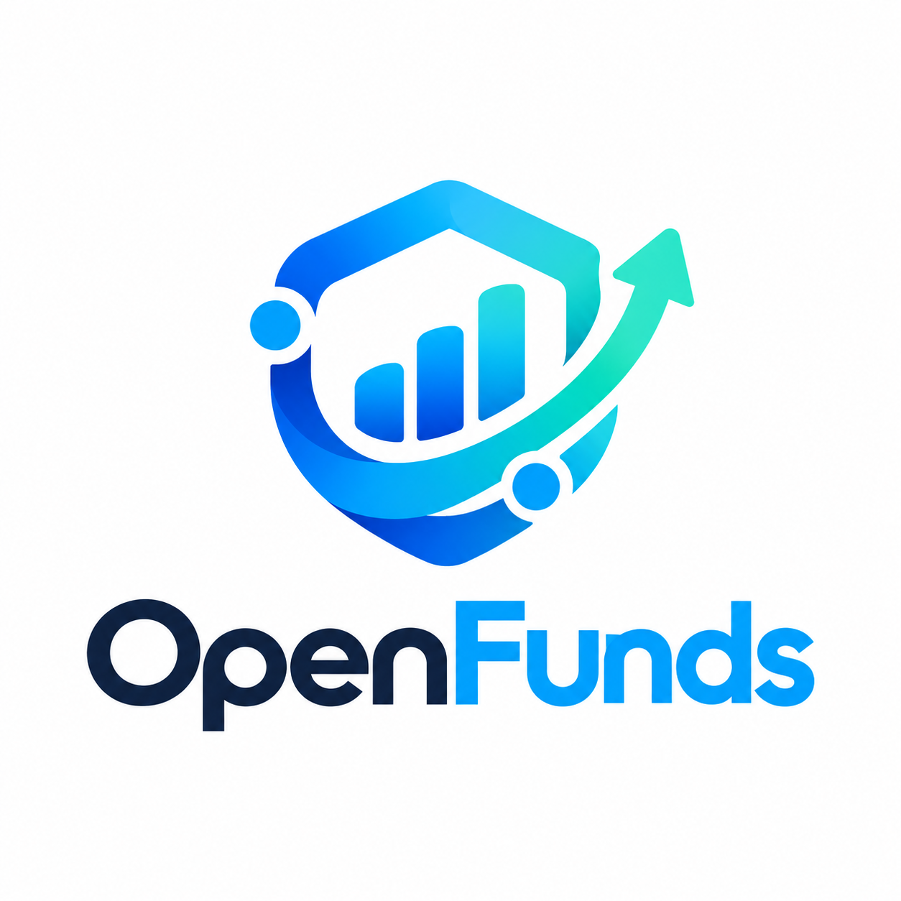
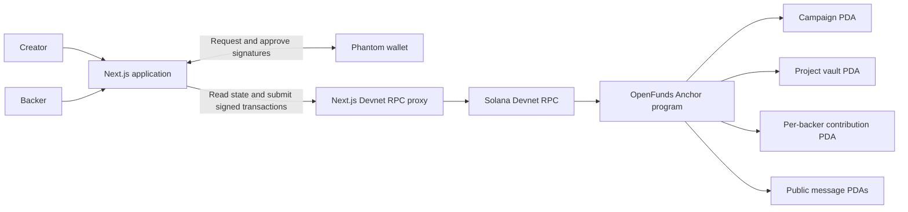

# OpenFunds — Transparent Crowdfunding on Solana

[](https://explorer.solana.com/address/Hcy7KiWQE1VfWE8LieGUSq8yAeL1AZEMqjKhDjomc7Fe?cluster=devnet)
[](frontend/package.json)
[](solana/anchor/programs/openfunds/src/lib.rs)
[](#summary-of-features)

> Create a project, support it with test SOL, follow its contributions and discussion, and receive a recorded refund after fundraising closes — all through shared Solana state.

[Live Demo](https://openfunds-eight.vercel.app) · [Source Code](https://github.com/makhsad/openfunds/tree/feature/full-openfunds) · [Program Explorer](https://explorer.solana.com/address/Hcy7KiWQE1VfWE8LieGUSq8yAeL1AZEMqjKhDjomc7Fe?cluster=devnet) · [Local Testing Guide](solana/anchor/LOCAL_TESTING.md)

---

<p align="center">
  
</p>

---

## Colosseum Hackathon Prototype

OpenFunds is a crowdfunding prototype built toward milestone-based funding on Solana. The current implementation covers project creation, contributions, public discussion, closure, and refunds. Milestone voting and payouts to creators are planned features.

| Name    | Role          | Contact                              |
| ------- | ------------- | ------------------------------------ |
| makhsad | Project owner | [GitHub](https://github.com/makhsad) |

The demo runs on **Solana Devnet** with test SOL. It contains real signed Devnet transactions and shared project data that two people can access from different devices.

---

## Problem and Solution

### 1. Unclear Movement of Funds

- **Problem:** Backers need to understand where their contribution went and how much a project has actually received.
- **OpenFunds:** Contributions go to a project-specific, program-controlled vault. The application displays recorded funding, vault balances, transaction history, and Explorer receipts.

### 2. Disconnected Creator and Backer Views

- **Problem:** A demo stored only in one browser cannot show both participants the same project or contribution history.
- **OpenFunds:** Project state, contributions, messages, and refund records are stored on Solana. Creators and backers share the same project page across devices.

### 3. Unclear Refunds When Fundraising Ends

- **Problem:** Backers need a clear way to recover their recorded contribution when a creator closes fundraising.
- **OpenFunds:** Closing a project stops new contributions. The creator can refund outstanding contributions, and each backer can also claim their own refund. The program validates the recipient and prevents duplicate refunds.

### 4. Difficult Testing of Both Roles

- **Problem:** Testing as both a creator and a backer becomes confusing when the application does not follow wallet account changes.
- **OpenFunds:** Phantom account switching updates the active wallet. Public addresses can be remembered and labeled, and a dashboard shows projects created or supported by the active account.

---

## Why Solana

- **Shared state:** Project data and funding records are available independently of a participant's browser or device.
- **Wallet signatures:** Creators and backers approve their own transactions through Phantom.
- **Program-controlled accounts:** Separate campaign, vault, and contribution accounts keep project funding and backer records distinct.
- **Public verification:** Transaction receipts and account state can be inspected on Solana Explorer.
- **Devnet testing:** Test SOL allows the full funding and refund flow to be demonstrated before considering a production network.

---

## Summary of Features

- Phantom connection, active account switching, and labels for remembered public addresses.
- Multiple projects per creator, with a title, description, funding goal, and optional image URL.
- Project-specific vaults and per-backer contribution records; repeated contributions accumulate.
- Shared project catalog, detail pages, creator/backer profiles, and personal dashboards.
- Funding totals, refunds, transaction fees, and links to confirmed transaction receipts.
- Public on-chain discussion for the creator and backers with a recorded contribution.
- Creator-controlled fundraising closure, followed by refunds to the original backers.
- Backer-initiated refund claims and continuation of interrupted refund batches.
- Compatibility with campaigns created by the earlier program version.

After closure, project history and discussion remain available to read. The project is archived rather than erased from the blockchain.

---

## Tech Stack

| Layer            | Technology                                                         |
| ---------------- | ------------------------------------------------------------------ |
| On-chain program | Rust · Anchor                                                      |
| Network          | Solana Devnet                                                      |
| Frontend         | Next.js · React · TypeScript · CSS                                 |
| Wallet           | Phantom                                                            |
| Solana clients   | `@solana/kit` · `@solana/web3.js`                                  |
| RPC access       | Next.js API route forwarding supported Devnet RPC calls            |
| Hosting          | Vercel                                                             |
| Testing          | Node.js test runner · Playwright · isolated Solana local validator |

---

## Architecture



A contribution moves SOL from the backer's wallet into the project's vault and updates the campaign and contribution records. After closure, a refund returns the outstanding recorded contribution to that backer's original address.

Network fees and account storage costs are separate from the recorded contribution. A refund returns the contribution amount; it does not reimburse previously paid fees or storage costs.

**Use the contribution button on the project page.** A direct transfer to the creator's personal wallet or an unrecorded transfer to the vault is not a registered OpenFunds contribution.

The standard demo does not require an external database. The application remembers wallet labels locally; project and funding data come from Solana.

---

## Quick Start

**Frontend prerequisites:** Node.js **20.9+**, npm, and Phantom for signing transactions. Node.js **24.10.0** was used during validation.

```bash
git clone https://github.com/makhsad/openfunds.git
cd openfunds
git switch feature/full-openfunds

cd frontend
npm ci
npm run dev
```

Open [http://127.0.0.1:3000](http://127.0.0.1:3000) in a browser with Phantom. Select **Solana Devnet** in Phantom and fund the test accounts with Devnet SOL.

The local frontend connects to the already deployed Devnet program. Demo users do not need to deploy the program or activate it again. The standard configuration does not require wallet keypair files, seed phrases, or additional environment variables.

For a production build, run these commands from `frontend/`:

```bash
npm run build
npm run start
```

### Demo With Two Wallets

1. Prepare a creator account and a separate backer account, both funded with Devnet test SOL.
2. The creator connects Phantom, opens **Create project**, publishes a project, and shares its URL.
3. The backer opens that URL on the same or a different device, connects their account, and contributes **0.01 SOL** twice.
4. Both participants verify **0.02 SOL** in recorded contributions, inspect the receipts, and exchange messages on the project page.
5. The creator closes fundraising and confirms the refund transactions. The backer verifies the returned **0.02 SOL**, accounting separately for transaction fees.

One person can test both roles by switching accounts inside Phantom. Remembering an address on the site does not grant access to sign for that account.

### Frontend Checks

Run from `frontend/`:

```bash
npm run lint
npm run typecheck
npm test
npm run build
npm run test:e2e
```

Browser tests use Playwright and a test wallet provider. Build the production frontend first, and have a compatible Playwright browser available. With compatible Chrome installed, a Bash shell can use:

```bash
PLAYWRIGHT_CHANNEL=chrome npm run test:e2e
```

Real Phantom testing remains a separate manual step.

### Anchor Build and Local Tests

The validated toolchain is **Anchor CLI 1.2.0**, **Solana/Agave 3.1.10**, and **cargo-build-sbf 3.1.10**. Solana utilities require Node.js **22.15+**. The offline build below assumes Rust, SBF tools, and Cargo dependencies are already installed and cached.

From the repository root:

```bash
cd solana
npm ci
cd anchor

anchor build --no-idl --ignore-keys --arch v0 -- --offline --skip-tools-install
anchor idl build -o target/idl/openfunds.json -- --offline
../node_modules/.bin/tsx --test tests/openfunds.test.ts
```

Use **SBF v0** with this validator configuration. The default SBF v3 build previously caused `Program is not deployed / Unsupported program id` at execution time.

The integration suite starts its own isolated local validator, loads the compiled program, uses disposable in-memory signers, and cleans up its temporary ledger. These tests do not deploy to Devnet and do not use existing wallet files.

See [LOCAL_TESTING.md](solana/anchor/LOCAL_TESTING.md) for account layouts and detailed compatibility notes.

---

## Validation

Recorded validation for the current unified release:

| Check                                | Result                                                                                                                 |
| ------------------------------------ | ---------------------------------------------------------------------------------------------------------------------- |
| Local validator integration suite    | 19 / 19 tests passed                                                                                                   |
| Frontend unit tests                  | 97 / 97 tests passed                                                                                                   |
| Desktop and mobile browser scenarios | Latest results for all 60 scenarios passed, including targeted reruns of two corrected confirmation checks             |
| Real Devnet flow                     | Creation → two 0.01 SOL contributions → message → closure → exact 0.02 SOL refund; all scenario transactions finalized |
| Legacy compatibility                 | Existing funded legacy campaign data and balances preserved during the program upgrade                                 |

Checks cover project isolation, repeated contributions, incorrect PDA rejection, zero-amount rejection, checked arithmetic, authorization, closed-project restrictions, and duplicate-refund protection.

---

## Roadmap

- [x] Campaign initialization and contribution tracking.
- [x] Multiple independent projects per creator.
- [x] Shared Devnet catalog, project pages, profiles, and dashboard.
- [x] Phantom account switching and remembered public address labels.
- [x] Authenticated public on-chain discussion.
- [x] Project closure, exact recorded refunds, and backer refund claims.
- [x] Local integration tests and a real Devnet funding/refund scenario.
- [x] Vercel-hosted demo connected to the deployed program.
- [ ] Editing published project metadata.
- [ ] Milestone voting.
- [ ] Milestone-based payouts to creators.
- [ ] Production hardening and Mainnet deployment.

The current program has no creator withdrawal or milestone payout instruction. Funds in the demonstrated flow are held in the project vault until refunded after closure.

---

## Repository Scope and Deployment

```text
frontend/                  Web application, RPC API, and frontend tests
solana/                    Solana utilities and test dependencies
solana/anchor/programs/    Rust Anchor program
solana/anchor/tests/       Local validator integration tests
solana/anchor/idl/         Public program IDL
```

This repository contains the core OpenFunds prototype: its web application, on-chain program, and tests. Older demo components remain in the frontend codebase; the active application routes use shared Devnet project data.

For Vercel, use **`frontend`** as the Root Directory and **`npm run build`** as the build command. The implementation branch is **`feature/full-openfunds`**.

Frontend publishing and Solana program upgrades are separate operations. The current Devnet program is already deployed and activated. Future upgrades require the program's upgrade authority.

**Devnet program ID:**

```text
Hcy7KiWQE1VfWE8LieGUSq8yAeL1AZEMqjKhDjomc7Fe
```

---

## Resources

- [Live application](https://openfunds-eight.vercel.app)
- [Implementation branch](https://github.com/makhsad/openfunds/tree/feature/full-openfunds)
- [Devnet program on Solana Explorer](https://explorer.solana.com/address/Hcy7KiWQE1VfWE8LieGUSq8yAeL1AZEMqjKhDjomc7Fe?cluster=devnet)
- [Anchor program source](solana/anchor/programs/openfunds/src/lib.rs)
- [Public program IDL](solana/anchor/idl/openfunds.json)
- [Local testing guide](solana/anchor/LOCAL_TESTING.md)
- [Project owner on GitHub](https://github.com/makhsad)

---

## License

An explicit repository license has not been added yet.
